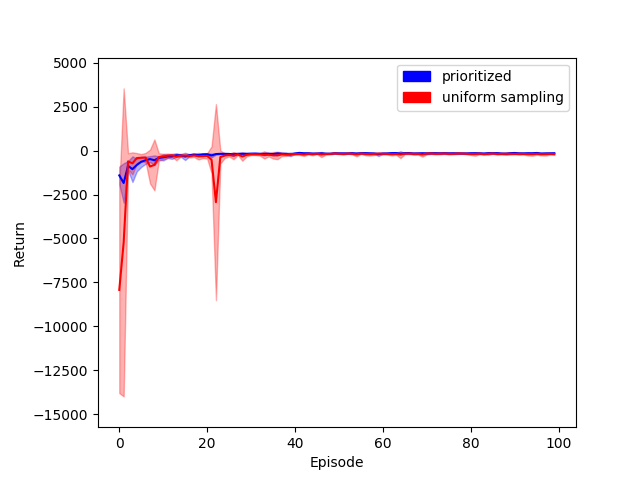

# Reinforce Learning Practice
Mountain Car (OpenAI gym) - Double Deep Q Network with Prioritized Experience Replay

## Prerequisite
- Python 3.6.4

## Install Dependency
```sh
$ pip install -r requirements.txt
```

## Usage
```sh
$ python usage: main.py [-h] [-i ITERATION] [-m MEMORYSIZE] [-b BATCHSIZE] [-lr LEARNINGRATE] [-hu HUMANEXP] [-hu--out HUMANEXPOUT] [-score--out SCOREOUT] [-screen SCREEN]
```

| optional Options           | Description                                    |
| ---                        | ---                                            |
| -h, --help                 | show this help message and exit                |
| -i ITERATION               | input the iteration of training                |
| -m MEMORYSIZE              | input the size of memory                       |
| -b BATCHSIZE               | input the size of batch                        |
| -lr LEARNINGRATE           | input learning rate                            |
| -hu HUMANEXP               | input human experience                         |
| -hu--out HUMANEXPOUT       | human experience output path                   |
| -score--out SCOREOUT       | score output path                              |
| -screen SCREEN             | show the screen of game (true/false)           | 


## Game


## Algorithm
- Double Deep Q Network With Prioritized Experience Replay
  - **Input:** minibatch k, step-size η, replay period K and size N, exponents α and β, budget
  - Initialize replay memory H = Φ,  = 0,  = 1
  - Observe  and choose 
  - **for** t = 1 **to** T **do**
    - Observe 
    - Store transition  in H with maximal priority 
    - **if** t ≡ 0 mod K **then**
      - **for** j = 1 **to** k **do**
        - Sample transition 
        - Compute importance-sampling weight 
        - Compute TD-error 
        - Update transition priority 
        - Accumulate weight-change 
      - **end for**
      - Update weights , reset ∆ = 0
      - From time to time copy weights into target network 
    - **end if**
    - Choose action 
  - **end for**

## Setting Reward
- According to [OpenAI gym](https://github.com/openai/gym/wiki/MountainCar-v0), we have:
  - Observation
  | Num | Observation | Min   | Max  |
  | --- | ---         | ---   | ---  |
  | 0   | position    | -1.2  | 0.6  |
  | 1   | velocity    | -0.07 | 0.07 |
- So we modify reward: 

## Performance




## Authors
[Yu-Tong Shen](https://github.com/yutongshen/)
